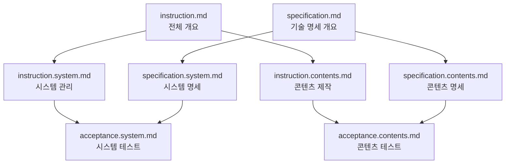

# Reveal.js Presentation System - User Instructions

> **버전**: 3.0.0
> **최종 업데이트**: 2025년 9월 27일
> **시스템 유형**: 범용 프레젠테이션 관리 시스템

## 📖 문서 개요

이 프로젝트는 reveal.js 기반의 범용 프레젠테이션 시스템입니다. 강의, 세미나, 발표 등 다양한 목적의 슬라이드를 효율적으로 관리하고 PDF로 생성할 수 있습니다.

## 🎯 시스템 특징

### 핵심 기능
- **📝 마크다운 기반**: 간편한 텍스트 편집으로 프레젠테이션 작성
- **🎨 테마 시스템**: 한글 폰트 지원 및 PDF 최적화
- **📄 PDF 생성**: 고품질 PDF 파일 자동 생성
- **🔄 자동화**: 콘텐츠 추가 시 자동 감지 및 네비게이션 생성
- **🌐 크로스 플랫폼**: Windows, Linux, macOS 지원

### 사용 사례
- **교육/강의**: 주차별, 챕터별 강의 자료
- **세미나/컨퍼런스**: 발표 자료 및 워크샵
- **기업 프레젠테이션**: 제품 소개, 보고서
- **개인 프로젝트**: 포트폴리오, 연구 발표

## 📂 프로젝트 구조

```
project/
├── slides/                 # 렌더링 컴포넌트
├── tools/                  # 개발 도구
├── scripts/                # 실행 스크립트
├── config/                 # 설정 파일
└── .claude/               # 프로젝트 문서
    ├── instruction.system.md      # 시스템 관리자용
    ├── instruction.contents.md    # 콘텐츠 제작자용
    ├── specification.system.md    # 시스템 기술 명세
    ├── specification.contents.md  # 콘텐츠 기술 명세
    ├── acceptance.system.md       # 시스템 테스트
    └── acceptance.contents.md     # 콘텐츠 테스트
```

## 👥 역할별 가이드

### 🔧 시스템 관리자 / 개발자
**대상**: 시스템 설치, 배포, 운영을 담당하는 사용자

**주요 문서**:
- **[instruction.system.md](instruction.system.md)** - 시스템 설치 및 운영 가이드
- **[specification.system.md](specification.system.md)** - 기술 아키텍처 및 구현 명세
- **[acceptance.system.md](acceptance.system.md)** - 시스템 기능 테스트

**주요 작업**:
- 개발 환경 설정
- 서버 배포 및 관리
- 성능 모니터링
- 보안 관리
- 장애 대응

### 📝 콘텐츠 제작자 / 강사
**대상**: 슬라이드 콘텐츠를 작성하고 관리하는 사용자

**주요 문서**:
- **[instruction.contents.md](instruction.contents.md)** - 콘텐츠 작성 및 관리 가이드
- **[specification.contents.md](specification.contents.md)** - 콘텐츠 구조 및 품질 기준
- **[acceptance.contents.md](acceptance.contents.md)** - 콘텐츠 품질 테스트

**주요 작업**:
- 슬라이드 콘텐츠 작성
- 메타데이터 관리
- 품질 검토
- PDF 생성 및 배포

## 🚀 빠른 시작

### 1. 시스템 관리자 워크플로우

```bash
# 1. 시스템 설정
./scripts/setup-linux.sh    # Linux/Mac
scripts\setup-windows.bat   # Windows

# 2. 개발 서버 시작
./scripts/start-dev.sh       # Linux/Mac
scripts\start-dev.bat        # Windows

# 3. 시스템 상태 확인
curl http://localhost:5173
```

자세한 내용: **[instruction.system.md](instruction.system.md)**

### 2. 콘텐츠 제작자 워크플로우

```bash
# 1. 새 주제 생성
mkdir slides/new-topic
touch slides/new-topic/slides.md
touch slides/new-topic/summary.md

# 2. 인덱스 생성
python3 tools/bootstrap.py

# 3. PDF 생성
./scripts/export-pdf.sh new-topic
```

자세한 내용: **[instruction.contents.md](instruction.contents.md)**

## 📊 시스템 상태

### 현재 버전 정보
- **시스템 버전**: 3.0.0
- **Reveal.js**: 4.x
- **Vite**: 5.x
- **Node.js**: 18+ 필요
- **Python**: 3.9+ 필요

### 지원 플랫폼
- **Windows**: 10, 11
- **macOS**: 12+
- **Linux**: Ubuntu 20.04+, CentOS 8+

### 브라우저 지원
- **Chrome**: 90+
- **Firefox**: 88+
- **Safari**: 14+
- **Edge**: 90+

## 🔗 문서 참조 관계



## 📝 문서 업데이트 정책

### 버전 관리
- **Major 버전**: 시스템 아키텍처 변경
- **Minor 버전**: 새로운 기능 추가
- **Patch 버전**: 버그 수정 및 개선

### 문서 동기화
- 시스템 변경 시 관련 문서 동시 업데이트
- 콘텐츠 표준 변경 시 가이드라인 반영
- 테스트 결과에 따른 문서 개선

## 🆘 지원 및 문의

### 시스템 관련 문의
- 설치/배포 문제: [instruction.system.md](instruction.system.md) 참조
- 기술적 이슈: [specification.system.md](specification.system.md) 참조
- 시스템 오류: [acceptance.system.md](acceptance.system.md) 참조

### 콘텐츠 관련 문의
- 작성 방법: [instruction.contents.md](instruction.contents.md) 참조
- 품질 기준: [specification.contents.md](specification.contents.md) 참조
- 검증 방법: [acceptance.contents.md](acceptance.contents.md) 참조

---

📧 **지원**: 이 시스템에 대한 질문이나 제안사항이 있으시면 프로젝트 이슈 트래커를 이용해 주세요.

🔄 **업데이트**: 이 문서는 시스템 업데이트와 함께 지속적으로 개선됩니다.